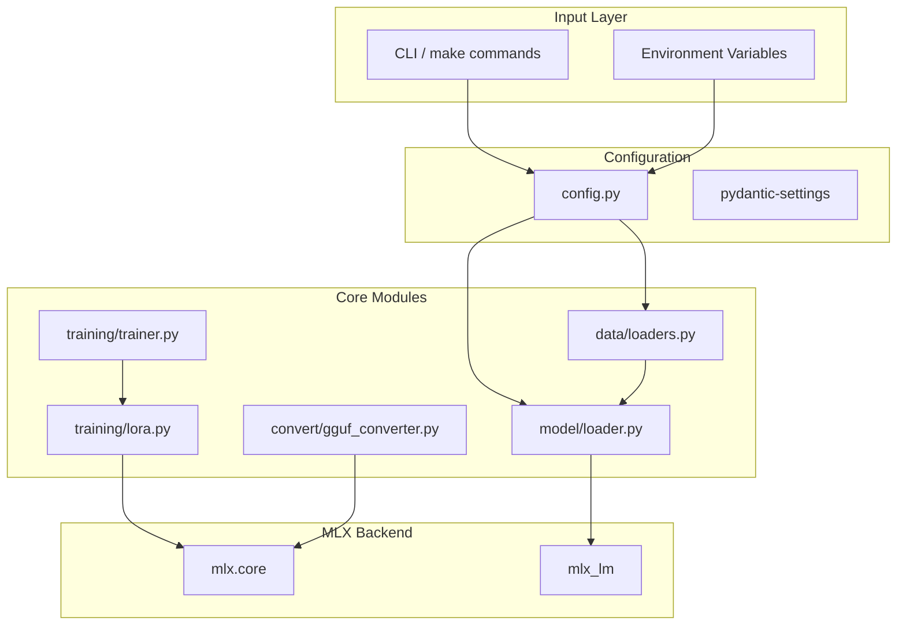

# MLX Tuner

Production-grade fine-tuning repository for Apple Silicon using the MLX framework. Implements LoRA/QLoRA fine-tuning with GGUF export capabilities.

## Overview

MLX Tuner provides a modular, testable architecture for fine-tuning large language models on Apple Silicon GPUs. Designed for 24GB M4 Pro unified memory with support for models up to 1.1B parameters.

## Features & Concepts (GenAI Developer's Glossary)

If you are coming from a high-level API background (e.g., using OpenAI endpoints or HuggingFace `pipeline()`), here is a simple translation of the low-level machine learning concepts used in this repository:

| Feature/Concept | Simple Explanation |
|---------|-------------|
| **LoRA** | **Low-Rank Adaptation.** Normally, fine-tuning an LLM means changing billions of numbers (weights). This requires massive GPU memory. LoRA "freezes" the original brain and just adds a tiny "sticky note" (a small matrix) on the side to learn new information. It reduces memory usage by 99%. |
| **LoRA Rank ($r$)** | The "size" of the sticky note. A rank of `8` means it's a small note (fast, low memory, but learns less complex patterns). A rank of `64` means a bigger note. |
| **LoRA Alpha ($\alpha$)** | A scaling factor (like a volume knob). It dictates how loudly the new "sticky note" overrides the original, frozen model weights. |
| **Dropout** | A trick to prevent the model from memorizing the training data. During training, it randomly "turns off" (drops out) a percentage of neurons, forcing the model to learn robust patterns rather than relying on a single memorized path. |
| **RSLoRA** | **Rank-Stabilized LoRA.** A mathematical tweak to standard LoRA. Normally, if you increase the Rank (the sticky note size) too much, the math blows up and ruins the model. RSLoRA fixes the math so you can use massive Ranks safely. |
| **Quantization** | Think of this as compressing a `.wav` audio file into an `.mp3`. It squashes 16-bit or 32-bit floating-point numbers into 8-bit or 4-bit numbers. It loses a tiny fraction of accuracy but allows massive models to run on consumer hardware. |
| **QLoRA** | **Quantized LoRA.** The ultimate memory hack: You "zip" (Quantize) the base model so it fits in RAM, and then you train using the tiny LoRA "sticky notes". |
| **GGUF Export** | GGUF is a file format (like `.zip` or `.mp4`) specifically for LLMs. It packs the model weights, tokenizer, and architecture into a single file that is highly optimized to be loaded quickly by C++ inference engines (like `llama.cpp` or our `metal-inference-core`). |
| **Protocol-based DI** | **Dependency Injection via Python Protocols.** Instead of using rigid base classes, we use Python's `typing.Protocol` (duck-typing). It simply means: "I don't care what object you pass to my function, as long as it has a `.load()` method." It makes writing unit tests extremely easy. |

## Quick Start

```bash
# Install dependencies
make install

# Run training with default config
make train

# Fuse adapters into base model
make fuse

# Convert to GGUF format
make convert
```

## Architecture Explained

For a GenAI software engineer, here is how the data flows through this system:

1. **Input / Config Layer:** You type `make train`. The system reads the `config.py` file, which uses `pydantic-settings` to securely load environment variables (like batch size and LoRA rank).
2. **Core Modules (The Business Logic):** 
   - `data/loaders.py` grabs your raw text data (JSONL) and tokenizes it.
   - `model/loader.py` downloads the base model (e.g., Llama 3) from HuggingFace.
   - `training/trainer.py` loops over your data, calculates how wrong the model is (the "loss"), and updates the LoRA weights (`lora.py`) to fix the mistakes.
3. **MLX Backend (The GPU Engine):** Apple's `mlx` framework does all the heavy math. Because of Unified Memory, it does this directly on the Apple Silicon GPU without needing slow memory copies.
4. **Convert Layer:** Once training is done, `convert/gguf_converter.py` squashes (quantizes) the model and saves it as a `.gguf` file so the C++ engine can run it.



## Project Structure

```
mlx-tuner/
├── src/mlx_tuner/          # Main package
│   ├── __init__.py          # Package exports
│   ├── config.py            # Configuration management
│   ├── logging.py          # Structured logging
│   ├── protocols.py        # Protocol classes (DI)
│   ├── data/               # Dataset loaders
│   │   ├── __init__.py
│   │   └── loaders.py      # JSONL, CSV loaders
│   ├── models/             # Model loading
│   │   ├── __init__.py
│   │   └── loader.py       # MLX model loader
│   ├── training/           # Training components
│   │   ├── __init__.py
│   │   ├── lora.py         # LoRA implementation
│   │   └── trainer.py     # Training loop
│   ├── convert/            # GGUF conversion
│   │   ├── __init__.py
│   │   └── gguf_converter.py
│   └── utils/              # Utilities
│       ├── __init__.py
│       └── checkpoint.py   # Checkpoint management
├── tests/                   # Test suite
│   ├── test_config.py
│   ├── test_loaders.py
│   ├── test_lora.py
│   └── test_gguf.py
├── configs/                 # Configuration files
├── data/                   # Training data
├── models/                 # Model cache
├── Dockerfile
├── Makefile
├── pyproject.toml
└── README.md
```

## Configuration

### Environment Variables

| Variable | Default | Description |
|----------|---------|-------------|
| `MODEL__NAME` | `SmolLM-135M` | HuggingFace model name |
| `MODEL__PATH` | `None` | Local model path |
| `LORA__RANK` | `8` | LoRA rank (r) |
| `LORA__ALPHA` | `8` | LoRA alpha |
| `LORA__DROPOUT` | `0.0` | LoRA dropout |
| `LORA__SCALE` | `10.0` | LoRA scaling factor |
| `TRAIN__BATCH_SIZE` | `2` | Training batch size |
| `TRAIN__STEPS` | `500` | Training steps |
| `TRAIN__LEARNING_RATE` | `2e-4` | Learning rate |
| `TRAIN__WARMUP_STEPS` | `50` | Warmup steps |
| `OUTPUT__ADAPTER_PATH` | `./adapters` | Adapter output path |
| `OUTPUT__GGUF_PATH` | `./models` | GGUF output path |

## Requirements

- Python 3.11+
- Apple Silicon Mac (M1/M2/M3/M4)
- 24GB+ unified memory recommended
- macOS 15+

## Dependencies

- `mlx` - Apple's ML framework
- `mlx-lm` - MLX language model utilities
- `transformers` - HuggingFace transformers
- `peft` - Parameter-efficient fine-tuning
- `pydantic-settings` - Configuration management
- `structlog` - Structured logging
- `pytest` - Testing framework
- `ruff` - Linting

## License

MIT
