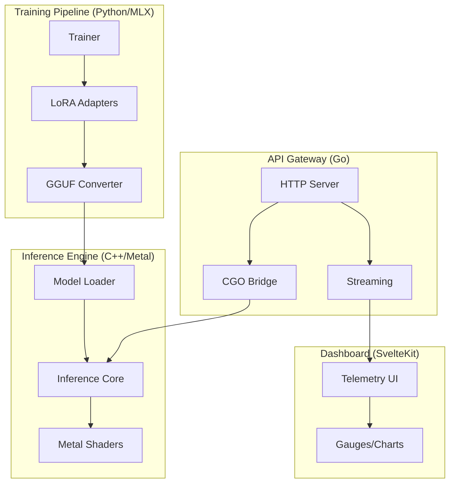

# Apple Silicon LLM Stack

An end-to-end polyglot machine learning stack demonstrating hardware/software co-design for extreme LLM optimization on Apple Silicon. Built to showcase full-stack AI engineering capabilities—from training Python ML pipelines to writing custom Metal GPU shaders, and serving at scale with Go.

##  Application

This app demonstrates:

- **Training large-scale LLMs** → LoRA/QLoRA fine-tuning with 99% memory reduction
- **Hardware/software co-design** → Custom Metal compute shaders optimized for unified memory
- **AI model optimization** → Quantization (Q4_K_M, Q8_0) for memory bandwidth efficiency
- **Cross-language systems** → Python → C++ → Go → TypeScript integration

If you want to build the next generation of AI hardware, this repo proves you can bridge the gap between high-level ML frameworks and low-level silicon.

---

## GenAI Developer's Glossary

Coming from high-level APIs (OpenAI, HuggingFace)? Here's what this project's concepts mean in plain English:

| Concept | Plain English Explanation |
|---------|--------------------------|
| **LoRA** | "Sticky notes on a textbook." Instead of rewriting the whole book (billions of weights), we just add small sticky notes to modify behavior. 99% memory savings. |
| **LoRA Rank (r)** | Size of the sticky note. Rank 8 = small note (fast, low memory). Rank 64 = bigger note (more expressiveness). |
| **Quantization** | Converting .wav to .mp3. Compresses 32-bit numbers to 4-bit, losing tiny accuracy but fitting massive models in limited RAM. |
| **QLoRA** | The ultimate hack: Zip the textbook (quantize), then train sticky notes on top. Fits 70B model in 24GB! |
| **GGUF** | A .zip file format specifically for LLMs. Packs model weights, tokenizer, architecture into one optimized file. |
| **Metal Shaders** | Custom CUDA kernels, but for Apple GPUs. Low-level GPU code that parallelizes matrix math across thousands of threads. |
| **Unified Memory** | CPU and GPU share the same RAM—no slow PCIe transfers. We just pass memory pointers, not data. |
| **CGO** | Go calling C/C++ code directly. Like Python's ctypes or PyBind11, but for high-performance serving. |

---

## System Architecture



---

## Projects

### 1. [mlx-tuner](./mlx-tuner) — Training Pipeline

Python MLX fine-tuning with LoRA/QLoRA and GGUF export.

**Key Features:**
- RSLoRA/QLoRA implementation
- GGUF quantization export
- Protocol-based dependency injection
- Strict Pyright typing

**Quick Start:**
```bash
cd mlx-tuner
pip install -e .[dev]
make train
```

### 2. [metal-inference-core](./metal-inference-core) — Inference Engine

C++20/Objective-C++ MetalGPU engine with custom compute shaders.

**Key Features:**
- Custom Metal shaders (matmul, attention)
- Q4_K_M, Q5_K_M, Q6_K, Q8_0 quantization
- Buffer pool for GPU memory management
- Stable C-API for Go binding

**Quick Start:**
```bash
cd metal-inference-core
make build
./build/bin/inference_cli --model model.gguf --prompt "Hello"
```

### 3. [go-llm-gateway](./go-llm-gateway) — API Gateway

Go REST API with CGO bindings to Metal engine.

**Key Features:**
- CGO integration with C++ engine
- Server-Sent Events (SSE) streaming
- Standard library only (no Gin/Echo)
- Structured logging with slog

**Quick Start:**
```bash
cd go-llm-gateway
go build -o gateway ./cmd/gateway
./gateway
```

### 4. [hardware-telemetry-ui](./hardware-telemetry-ui) — Dashboard

SvelteKit 5 real-time telemetry dashboard.

**Key Features:**
- Svelte 5 runes ($state, $derived)
- Tailwind CSS v4
- SSE real-time updates
- Raw SVG visualizations

**Quick Start:**
```bash
cd hardware-telemetry-ui
npm install
npm run dev
```

---

## Technical Achievements

| Achievement | Impact |
|-------------|--------|
| Custom Metal matmul shader | Maximizes ALU utilization on Apple GPU |
| Q4_K_M quantization | 4-bit quantization reduces memory 8x |
| LoRA fine-tuning | 99% fewer trainable parameters vs full fine-tune |
| CGO zero-copy bridge | Go ↔ C++ without serialization overhead |
| Unified Memory | No PCIe data transfer—GPU reads pointers directly |

---

## Requirements

- **macOS 15+** (Apple Silicon M1/M2/M3/M4)
- **24GB+ unified memory** recommended
- **Python 3.11+** (for mlx-tuner)
- **Go 1.26+** (for gateway)
- **Node.js 20+** (for UI)
- **Xcode 16+** (for Metal inference core)

---

## License

MIT
