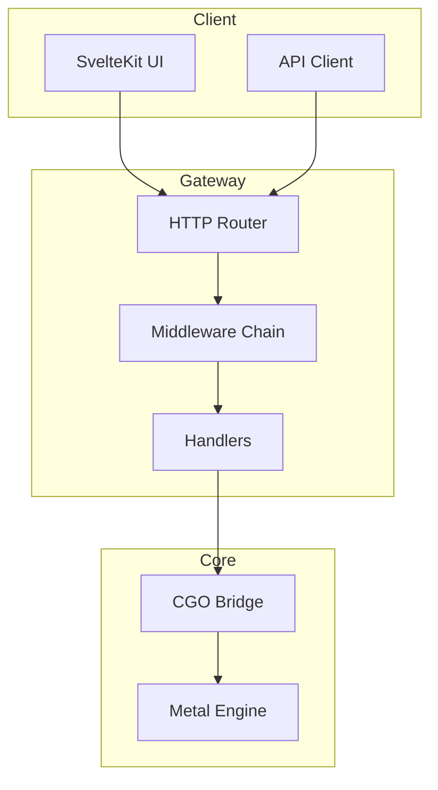

# Go LLM Gateway

High-performance API gateway for LLM inference with CGO bindings to metal-inference-core. Built with Go 1.26.

## Overview

Go LLM Gateway provides a RESTful API for LLM inference with:
- CGO integration with Metal inference engine
- Server-Sent Events (SSE) for streaming
- Rate limiting and CORS
- Structured logging with slog

## Features

| Feature | Description |
|---------|-------------|
| **CGO Bindings** | Direct integration with C++ Metal engine |
| **SSE Streaming** | Real-time token streaming |
| **Rate Limiting** | Request rate limiting middleware |
| **CORS** | Cross-origin request support |
| **Structured Logging** | JSON logging via slog |
| **Graceful Shutdown** | Clean server shutdown |

## Quick Start

```bash
# Build
go build -o gateway ./cmd/gateway

# Run
./gateway

# With custom port
APP_SERVER_PORT=:9090 ./gateway
```

## API Endpoints

### Health Check

```bash
GET /health
```

Response:
```json
{"status": "ok"}
```

### Ready Check

```bash
GET /ready
```

### Chat Completion

```bash
POST /api/v1/chat
Content-Type: application/json

{
  "messages": [
    {"role": "user", "content": "Hello"}
  ],
  "stream": true
}
```

### Telemetry (SSE)

```bash
GET /api/v1/telemetry
```

## Architecture



## Project Structure

```
go-llm-gateway/
├── cmd/
│   └── gateway/
│       └── main.go           # Entry point
├── internal/
│   ├── config/
│   │   ├── config.go         # Configuration
│   │   └── config_test.go    # Config tests
│   ├── model/
│   │   ├── model.go          # Domain models
│   │   ├── api.go            # API models
│   │   └── model_test.go     # Model tests
│   ├── handlers/
│   │   └── handlers.go       # HTTP handlers
│   ├── middleware/
│   │   └── middleware.go     # HTTP middleware
│   ├── cgobridge/
│   │   └── bridge.go         # CGO bindings
│   ├── metrics/
│   ├── service/
│   ├── sse/
│   └── worker/
├── configs/
├── scripts/
├── go.mod
├── go.sum
└── README.md
```

## Configuration

### Environment Variables

| Variable | Default | Description |
|----------|---------|-------------|
| `APP_SERVER_PORT` | `:8080` | Server port |
| `APP_SERVER_READ_TIMEOUT` | `30` | Read timeout (seconds) |
| `APP_SERVER_WRITE_TIMEOUT` | `30` | Write timeout (seconds) |
| `APP_ENGINE_MODEL_PATH` | `./model.gguf` | Model file path |
| `APP_ENGINE_N_THREADS` | `4` | CPU threads |
| `APP_ENGINE_N_GPU_LAYERS` | `32` | GPU layers |
| `APP_ENGINE_CONTEXT_LENGTH` | `2048` | Context length |
| `APP_LOGGING_LEVEL` | `info` | Logging level |

## Running

### Development

```bash
go run ./cmd/gateway
```

### Production

```bash
go build -o gateway ./cmd/gateway
./gateway
```

### Docker

```dockerfile
FROM golang:1.26-alpine AS builder
WORKDIR /app
COPY go.mod go.sum ./
RUN go mod download
COPY . .
RUN go build -o gateway ./cmd/gateway

FROM alpine:latest
COPY --from=builder /app/gateway /gateway
COPY --from=builder /app/model.gguf /model.gguf
ENTRYPOINT ["/gateway"]
```

## Requirements

- Go 1.26+
- C++ Metal inference core (optional, for actual inference)
- GGUF model file

## Dependencies

- None (standard library + CGO)

## License

MIT
