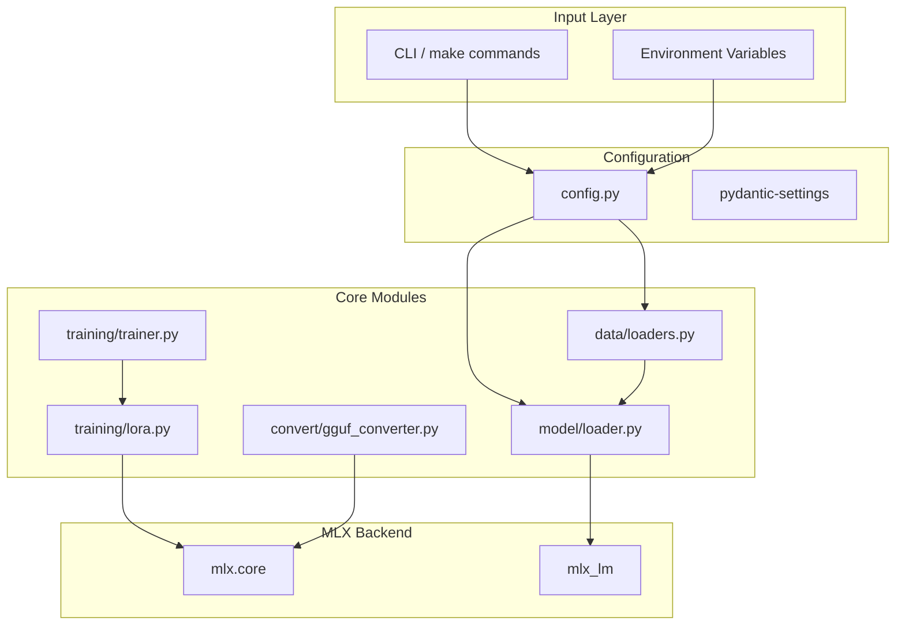

# MLX Tuner

Production-grade fine-tuning repository for Apple Silicon using the MLX framework. Implements LoRA/QLoRA fine-tuning with GGUF export capabilities.

## Overview

MLX Tuner provides a modular, testable architecture for fine-tuning large language models on Apple Silicon GPUs. Designed for 24GB M4 Pro unified memory with support for models up to 1.1B parameters.

## Features

| Feature | Description |
|---------|-------------|
| **RSLoRA** | Rank-Stabilized LoRA with configurable rank, alpha, dropout |
| **QLoRA** | Quantized LoRA for memory-efficient training |
| **GGUF Export** | Convert fine-tuned models to GGUF format |
| **Protocol-based DI** | Full dependency injection for testability |
| **Structured Logging** | JSON logging for production, console for dev |
| **Type Safety** | Full type hints with pyright strict mode |

## Quick Start

```bash
# Install dependencies
make install

# Run training with default config
make train

# Fuse adapters into base model
make fuse

# Convert to GGUF format
make convert
```

## Architecture



## Project Structure

```
mlx-tuner/
├── src/mlx_tuner/          # Main package
│   ├── __init__.py          # Package exports
│   ├── config.py            # Configuration management
│   ├── logging.py          # Structured logging
│   ├── protocols.py        # Protocol classes (DI)
│   ├── data/               # Dataset loaders
│   │   ├── __init__.py
│   │   └── loaders.py      # JSONL, CSV loaders
│   ├── models/             # Model loading
│   │   ├── __init__.py
│   │   └── loader.py       # MLX model loader
│   ├── training/           # Training components
│   │   ├── __init__.py
│   │   ├── lora.py         # LoRA implementation
│   │   └── trainer.py     # Training loop
│   ├── convert/            # GGUF conversion
│   │   ├── __init__.py
│   │   └── gguf_converter.py
│   └── utils/              # Utilities
│       ├── __init__.py
│       └── checkpoint.py   # Checkpoint management
├── tests/                   # Test suite
│   ├── test_config.py
│   ├── test_loaders.py
│   ├── test_lora.py
│   └── test_gguf.py
├── configs/                 # Configuration files
├── data/                   # Training data
├── models/                 # Model cache
├── Dockerfile
├── Makefile
├── pyproject.toml
└── README.md
```

## Configuration

### Environment Variables

| Variable | Default | Description |
|----------|---------|-------------|
| `MODEL__NAME` | `SmolLM-135M` | HuggingFace model name |
| `MODEL__PATH` | `None` | Local model path |
| `LORA__RANK` | `8` | LoRA rank (r) |
| `LORA__ALPHA` | `8` | LoRA alpha |
| `LORA__DROPOUT` | `0.0` | LoRA dropout |
| `LORA__SCALE` | `10.0` | LoRA scaling factor |
| `TRAIN__BATCH_SIZE` | `2` | Training batch size |
| `TRAIN__STEPS` | `500` | Training steps |
| `TRAIN__LEARNING_RATE` | `2e-4` | Learning rate |
| `TRAIN__WARMUP_STEPS` | `50` | Warmup steps |
| `OUTPUT__ADAPTER_PATH` | `./adapters` | Adapter output path |
| `OUTPUT__GGUF_PATH` | `./models` | GGUF output path |

## Requirements

- Python 3.11+
- Apple Silicon Mac (M1/M2/M3/M4)
- 24GB+ unified memory recommended
- macOS 15+

## Dependencies

- `mlx` - Apple's ML framework
- `mlx-lm` - MLX language model utilities
- `transformers` - HuggingFace transformers
- `peft` - Parameter-efficient fine-tuning
- `pydantic-settings` - Configuration management
- `structlog` - Structured logging
- `pytest` - Testing framework
- `ruff` - Linting

## License

MIT
