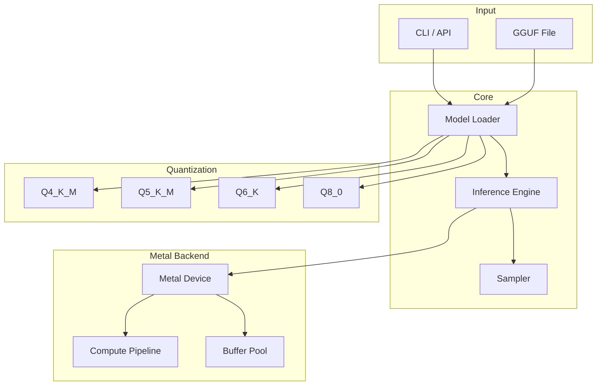

# Metal Inference Core

High-performance C++20 Metal inference engine for GGUF models on Apple Silicon. Production-ready implementation with C-API bindings for Go gateway integration.

## Overview

Metal Inference Core provides low-latency LLM inference using Apple's Metal framework for GPU acceleration. Designed for the M4 Pro (24GB) with support for quantized models.

## Features

| Feature | Description |
|---------|-------------|
| **C++20** | Modern C++ with concepts, RAII, structured bindings |
| **Metal 3.0** | Native GPU acceleration with memory coalescing |
| **C-API** | Stable ABI for Go/Python interop via CGO |
| **Quantization** | Q4_K_M, Q5_K_M, Q6_K, Q8_0 support |
| **KV Cache** | Paged attention with Metal buffer management |
| **Sampling** | Greedy, top-k, top-p, temperature sampling |

## Quick Start

```bash
# Build the project
make build

# Run the CLI
./build/bin/inference_cli --model model.gguf --prompt "Hello"

# Run tests
make test

# Run benchmarks
make bench
```

## Architecture



## Project Structure

```
metal-inference-core/
├── include/metal_inference/
│   ├── engine.h           # Main inference engine
│   └── types.h            # Type definitions
├── src/
│   ├── CMakeLists.txt
│   ├── core/
│   │   ├── engine.cpp     # Inference orchestration
│   │   ├── model_loader.cpp
│   │   └── sampler.cpp    # Sampling strategies
│   ├── metal/
│   │   ├── device.mm      # Metal device wrapper
│   │   ├── compute_pipeline.mm
│   │   └── buffer_pool.mm
│   └── quantization/
│       └── quantize.hpp   # Quantization kernels
├── shaders/
│   └── matmul.metal       # Metal shaders
├── tools/
│   └── main.cpp           # CLI implementation
├── tests/
│   ├── unit/
│   │   └── main.cpp       # Unit tests
│   └── integration/
├── cmake/                  # CMake modules
├── CMakeLists.txt
├── Makefile
└── README.md
```

## Requirements

- macOS 15.0+ (Apple Silicon)
- Xcode 16+
- CMake 3.28+
- C++20 compatible compiler (Apple Clang 17+)

## Dependencies

- **spdlog** - Logging (header-only, fetched via CMake)
- **Metal.framework** - GPU runtime (system)
- **MetalPerformanceShaders.framework** - Optimized kernels (system)

## Configuration

### Inference Options

| Option | Default | Description |
|--------|---------|-------------|
| `--model` | Required | Path to GGUF model |
| `--prompt` | Required | Input prompt |
| `--n_threads` | 4 | CPU threads |
| `--n_gpu_layers` | 32 | GPU layers |
| `--context_length` | 2048 | Max context |
| `--temp` | 0.8 | Temperature |
| `--top_p` | 0.95 | Top-p sampling |
| `--top_k` | 40 | Top-k sampling |

### Environment Variables

| Variable | Default | Description |
|----------|---------|-------------|
| `MTL_DEBUG` | 0 | Metal validation layer |
| `MTL_ENABLE_STATS` | 0 | GPU statistics |

## Performance

### Expected Performance (M4 Pro)

| Model Size | Quantization | Tokens/sec |
|------------|-------------|------------|
| 135M | Q4_K_M | ~80-100 |
| 1.1B | Q4_K_M | ~40-60 |
| 1.1B | Q8_0 | ~25-35 |

### Memory Usage

| Model | Quantization | VRAM |
|-------|-------------|------|
| 135M | Q4_K_M | ~200MB |
| 1.1B | Q4_K_M | ~700MB |
| 1.1B | Q8_0 | ~1.4GB |

## C-API Usage

```c
#include <metal_inference/engine.h>

int main() {
    // Create engine
    MTLEngine* engine = mtle_engine_create("./model.gguf");
    
    // Inference
    MTLInferenceRequest req = {
        .prompt = "Hello world",
        .max_tokens = 100,
        .temperature = 0.8f,
    };
    
    MTLResult* result = mtle_engine_infer(engine, &req);
    
    printf("Generated: %s\n", result->text);
    
    // Cleanup
    mtle_result_free(result);
    mtle_engine_destroy(engine);
    
    return 0;
}
```

## Building

### Debug Build

```bash
mkdir build && cd build
cmake .. -DCMAKE_BUILD_TYPE=Debug
make -j4
```

### Release Build

```bash
mkdir build && cd build
cmake .. -DCMAKE_BUILD_TYPE=Release
make -j4
```

### With Sanitizers

```bash
cmake .. -DENABLE_SANITIZERS=ON -DCMAKE_BUILD_TYPE=Debug
make -j4
```

## Testing

```bash
# Run all tests
make test

# Run with verbose output
ctest --output-on-failure -V

# Run specific test
./build/bin/unit_tests
```

## License

MIT
