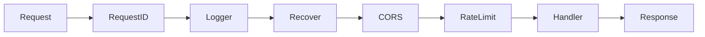
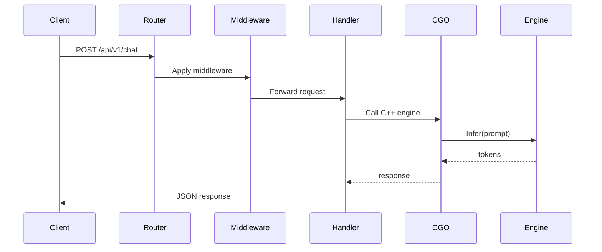
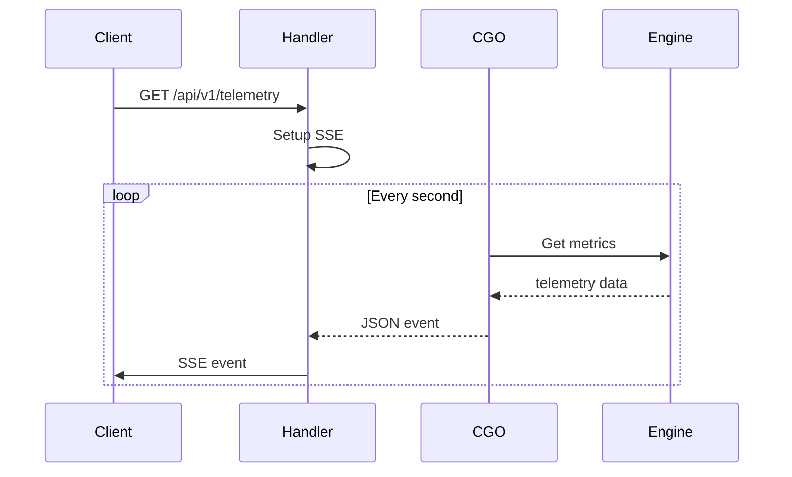

# Go LLM Gateway - Architecture

## System Overview

```
┌─────────────────────────────────────────────────────────────┐
│                      HTTP Server                            │
│                    (net/http + slog)                       │
└─────────────────────────────────────────────────────────────┘
                              │
                              ▼
┌─────────────────────────────────────────────────────────────┐
│                   Middleware Chain                          │
│  RequestID → Logger → Recover → CORS → RateLimit          │
└─────────────────────────────────────────────────────────────┘
                              │
                              ▼
┌─────────────────────────────────────────────────────────────┐
│                     Handlers                                │
│  HealthCheck │ ReadyCheck │ ChatHandler                    │
└─────────────────────────────────────────────────────────────┘
                              │
                              ▼
┌─────────────────────────────────────────────────────────────┐
│                    CGO Bridge                              │
│              (Go ↔ C++ Interop)                            │
└─────────────────────────────────────────────────────────────┘
                              │
                              ▼
┌─────────────────────────────────────────────────────────────┐
│               Metal Inference Engine                        │
│            (C++20 + Metal Framework)                       │
└─────────────────────────────────────────────────────────────┘
```

## Component Design

### Configuration (`internal/config/`)

Environment-based configuration with sensible defaults:

```go
type Config struct {
    Server  ServerConfig
    Engine  EngineConfig
    Logging LoggingConfig
}

type ServerConfig struct {
    Port         string
    ReadTimeout  int
    WriteTimeout int
}

func Load() *Config {
    // Load from environment with defaults
}
```

### Domain Models (`internal/model/`)

Core domain types:

```go
type Response[T any] struct {
    Success bool   `json:"success"`
    Data    T      `json:"data,omitempty"`
    Error   string `json:"error,omitempty"`
}

type DomainError struct {
    Code    string
    Message string
    Err     error
}
```

### Middleware Chain (`internal/middleware/`)

Composable middleware pattern:

```go
func Chain(h http.Handler, middleware ...func(http.Handler) http.Handler) http.Handler {
    for _, m := range middleware {
        h = m(h)
    }
    return h
}

// Usage
handler := Chain(router,
    RequestID,
    Logger,
    Recover,
    CORS,
    RateLimit,
)
```

**Middleware Flow**:



### Handlers (`internal/handlers/`)

HTTP request handling:

```go
func HealthCheck(w http.ResponseWriter, r *http.Request) {
    w.Header().Set("Content-Type", "application/json")
    json.NewEncoder(w).Encode(model.HealthStatus{Status: "ok"})
}

func Chat(engine *Engine) http.HandlerFunc {
    return func(w http.ResponseWriter, r *http.Request) {
        // Handle chat request
    }
}
```

### CGO Bridge (`internal/cgobridge/`)

Go to C++ interop:

```go
// #include "metal_inference/engine.h"
import "C"

type Engine struct {
    ptr *C.MTLEngine
}

func NewEngine() *Engine {
    return &Engine{
        ptr: C.mtle_engine_create(C.CString("./model.gguf")),
    }
}

func (e *Engine) Infer(prompt string) string {
    cPrompt := C.CString(prompt)
    defer C.free(unsafe.Pointer(cPrompt))
    
    result := C.mtle_engine_infer(e.ptr, cPrompt)
    return C.GoString(result)
}
```

## Data Flow

### Chat Request Flow



### SSE Streaming Flow



## SOLID Principles

### Single Responsibility

| Package | Responsibility |
|---------|---------------|
| `config` | Configuration only |
| `model` | Domain types only |
| `handlers` | HTTP handling only |
| `middleware` | HTTP middleware only |
| `cgobridge` | CGO interop only |

### Dependency Inversion

```go
// ❌ Direct dependency
func handler() {
    engine := NewEngine() // Direct creation
}

// ✅ Dependency injection
func handler(engine *Engine) {
    engine.Infer(prompt) // Injected
}
```

### Interface Segregation

```go
// Small, focused interfaces
type Engine interface {
    Infer(prompt string) string
    Destroy()
}
```

## Error Handling

### Domain Errors

```go
type DomainError struct {
    Code    string
    Message string
    Err     error
}

func (e *DomainError) Error() string {
    return e.Message
}

func (e *DomainError) Unwrap() error {
    return e.Err
}
```

### HTTP Error Handling

```go
func handleError(w http.ResponseWriter, err error) {
    var domainErr *DomainError
    if errors.As(err, &domainErr) {
        w.WriteHeader(http.StatusBadRequest)
        json.NewEncoder(w).Encode(Response[string]{
            Success: false,
            Error:   domainErr.Message,
        })
        return
    }
    
    w.WriteHeader(http.StatusInternalServerError)
    json.NewEncoder(w).Encode(Response[string]{
        Success: false,
        Error:   "Internal server error",
    })
}
```

## Logging

Using Go's structured logging:

```go
slog.SetDefault(slog.New(slog.NewJSONHandler(os.Stdout, &slog.HandlerOptions{
    Level: slog.LevelInfo,
})))

slog.Info("request", 
    "method", r.Method, 
    "url", r.URL.Path,
    "request_id", requestID,
)
```

## Performance

### Connection Handling

- Read/Write timeouts prevent slow clients
- Graceful shutdown with draining

```go
srv := &http.Server{
    Addr:         ":8080",
    Handler:      handler,
    ReadTimeout:  30 * time.Second,
    WriteTimeout: 30 * time.Second,
    IdleTimeout:  60 * time.Second,
}
```

### Memory Management

- CGO call overhead minimized
- Reusable buffer pools in C++
