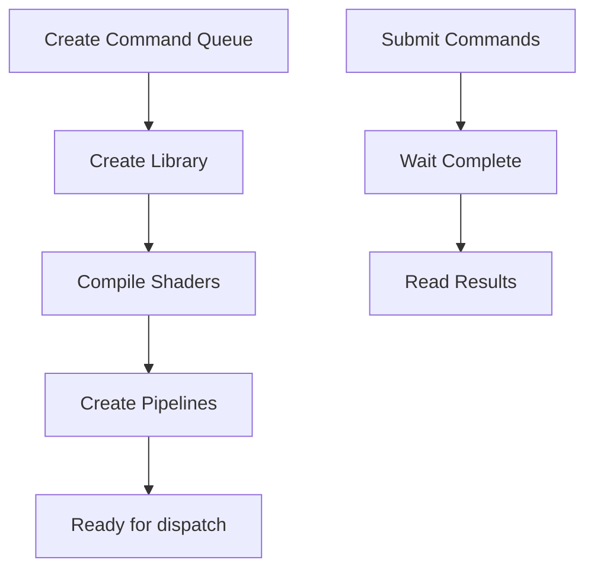
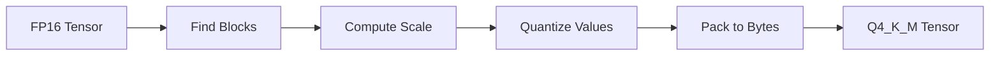

# Metal Inference Core - Architecture

## System Overview

Metal Inference Core follows a layered architecture with clear separation between CPU and GPU responsibilities:

```
┌─────────────────────────────────────────────────────────────┐
│                    CLI / C-API Layer                        │
│                   (tools/main.cpp)                          │
│     * Exposes Opaque Pointers (Pimpl Idiom) for FFI *       │
└─────────────────────────────────────────────────────────────┘
                              │
                              ▼
┌─────────────────────────────────────────────────────────────┐
│                   Inference Engine                          │
│                   (core/engine.cpp)                         │
│  ┌─────────────┐ ┌─────────────┐ ┌─────────────┐          │
│  │ Model Loader│ │   Sampler   │ │  Scheduler  │          │
│  └─────────────┘ └─────────────┘ └─────────────┘          │
└─────────────────────────────────────────────────────────────┘
                              │
                              ▼
┌─────────────────────────────────────────────────────────────┐
│                    Metal Backend                            │
│              (metal/*.mm + shaders/*.metal)                 │
│  ┌─────────────┐ ┌─────────────┐ ┌─────────────┐          │
│  │   Device    │ │   Pipeline  │ │ Buffer Pool │          │
│  └─────────────┘ └─────────────┘ └─────────────┘          │
└─────────────────────────────────────────────────────────────┘
                              │
                              ▼
┌─────────────────────────────────────────────────────────────┐
│                    Hardware                                 │
│                 (Apple Silicon GPU)                         │
└─────────────────────────────────────────────────────────────┘
```

## Component Design

### Model Loader (`core/model_loader.cpp`)

Responsible for:
- Parsing GGUF files
- Loading model weights
- Allocating GPU memory


### Inference Engine (`core/engine.cpp`)

Orchestrates the inference pipeline:

```cpp
class Engine {
public:
    InferenceResult infer(const InferenceRequest& req) {
        auto tokens = tokenize(req.prompt);
        
        for (size_t i = 0; i < req.max_tokens; ++i) {
            // Forward pass
            auto logits = forward(tokens);
            
            // Sample next token
            auto next_token = sampler->sample(logits);
            
            tokens.push_back(next_token);
            
            // Check for EOS
            if (next_token == EOS) break;
        }
        
        return detokenize(tokens);
    }
    
private:
    Tensor forward(const std::vector<Token>& tokens);
    std::unique_ptr<Sampler> sampler;
    std::unique_ptr<MetalDevice> device;
};
```

### Sampler (`core/sampler.cpp`)

Implements various sampling strategies:

```cpp
class Sampler {
public:
    Token sample(const Tensor& logits) {
        switch (strategy_) {
            case Strategy::Greedy:
                return greedy(logits);
            case Strategy::TopK:
                return top_k(logits, k_);
            case Strategy::TopP:
                return top_p(logits, p_);
            case Strategy::Temperature:
                return temperature(logits, temp_);
        }
    }
    
private:
    Strategy strategy_;
    float k_ = 40;
    float p_ = 0.95;
    float temperature_ = 0.8;
};
```

### Metal Device (`metal/device.mm`)

Wraps Metal device and command queue:

> **IMPORTANT: Understanding the Metal Backend (Python/CUDA Analogy)**
> - Think of **Metal** as Apple's proprietary version of NVIDIA's CUDA. It gives us raw, low-level access to the GPU shader cores.
> - Think of **Objective-C++ (`.mm`)** as the equivalent of `pybind11` or `ctypes` in Python. Because Apple's native APIs are written in Objective-C, we compile these specific files as Objective-C++ to allow our standard, fast C++20 code to natively talk to the Apple GPU without performance-killing workarounds.



### Buffer Pool (`metal/buffer_pool.mm`)

Manages GPU memory allocation:

> **IMPORTANT: Apple Silicon Unified Memory Architecture (UMA) & Memory Pooling**
> - In Python, the Garbage Collector handles memory for you. But on a GPU, allocating and freeing memory on-the-fly inside a tight training loop is incredibly slow. The `Buffer Pool` pre-allocates massive chunks of GPU memory upfront and manually slices them up for the KV-Cache and tensors.
> - By utilizing `MTLResourceStorageModeShared`, the Buffer Pool allocates memory that is symmetrically visible to both the CPU and the Apple Silicon GPU. This means we achieve true zero-copy inference: no slow PCIe bus transfers occur between host RAM and device VRAM, allowing for incredibly high throughput and optimal power efficiency.

```cpp
class BufferPool {
public:
    Buffer* allocate(size_t size) {
        // Find cached buffer or allocate new
        if (auto it = cache_.find(size); it != cache_.end()) {
            return it->second;
        }
        return new Buffer(device_, size);
    }
    
    void deallocate(Buffer* buf) {
        // Return to cache for reuse
        cache_[buf->size()] = buf;
    }
};
```

## Quantization System

### Supported Formats

| Format | Bits/Param | Quality | Speed |
|--------|-----------|---------|-------|
| Q8_0 | 8 | Highest | Fast |
| Q6_K | 6 | High | Faster |
| Q5_K_M | 5 | Medium | Fast |
| Q4_K_M | 4 | Good | Fastest |

### Quantization Flow



### Dequantization in Kernel

Metal shaders handle on-the-fly dequantization:

```metal
kernel void dequantize_q4_k_m(
    device const char4* quantized [[buffer(0)]],
    device const float* scales [[buffer(1)]],
    device float* output [[buffer(2)]],
    uint id [[thread_position_in_grid]]
) {
    // Load 32 values per thread group
    // Apply scale and store FP16
}
```

## Memory Management

### KV Cache

Paged attention with fixed-size pages:

```
┌─────────┬─────────┬─────────┬─────────┐
│ Page 0  │ Page 1  │ Page 2  │ Page N  │
│  KV[0-7]│ KV[8-15]│KV[16-23]│  ...   │
└─────────┴─────────┴─────────┴─────────┘
```

### Memory Layout

| Region | Size | Purpose |
|--------|------|---------|
| Model Weights | ~700MB | Q4_K_M 1.1B |
| KV Cache | ~500MB | 2K context |
| Activation | ~100MB | Forward pass |
| Scratch | ~50MB | Temporary |

## SOLID Principles

### Single Responsibility

| Component | Responsibility |
|-----------|---------------|
| `model_loader.cpp` | GGUF parsing only |
| `engine.cpp` | Inference orchestration |
| `sampler.cpp` | Token sampling |
| `device.mm` | Metal device management |
| `buffer_pool.mm` | Memory allocation |

### Dependency Inversion

High-level modules depend on abstractions:

```cpp
// Abstract interface for device
class IDevice {
public:
    virtual Tensor allocate(size_t size) = 0;
    virtual void submit(CommandBuffer&) = 0;
    virtual ~IDevice() = default;
};

// Concrete implementation
class MetalDevice : public IDevice {
    // Metal-specific implementation
};
```

### Composition over Inheritance

```cpp
class Engine {
    // Composition: uses other components
    std::unique_ptr<ModelLoader> loader_;
    std::unique_ptr<Sampler> sampler_;
    std::unique_ptr<MetalDevice> device_;
};
```

## Error Handling

### Error Enum

```cpp
enum class Error : uint32_t {
    Ok = 0,
    InvalidModel,
    OutOfMemory,
    MetalDeviceNotFound,
    ShaderCompilationFailed,
    InvalidTensorShape,
};
```

### Expected Pattern

```cpp
// Using std::expected (C++23, adapted for C++20)
std::expected<Tensor, Error> allocate_tensor(size_t size) {
    if (size > available_memory()) {
        return std::unexpected(Error::OutOfMemory);
    }
    return Tensor(size);
}
```
