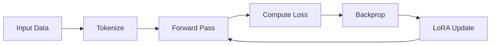
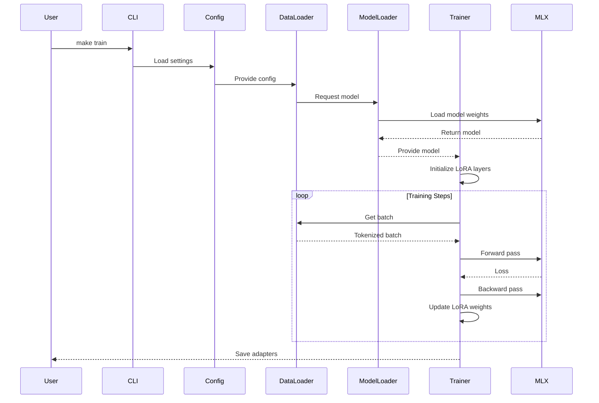
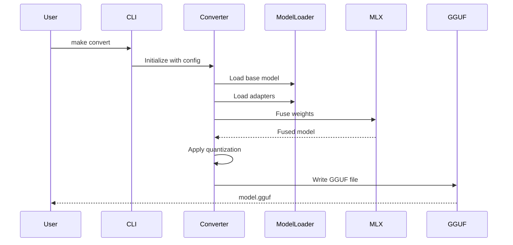

# MLX Tuner - Architecture

## System Overview

MLX Tuner follows a layered architecture with clear separation of concerns:

```
┌─────────────────────────────────────────────────────────────┐
│                      Entry Points                           │
│  (CLI via Makefile / Python scripts / Direct invocation)   │
└─────────────────────────────────────────────────────────────┘
                              │
                              ▼
┌─────────────────────────────────────────────────────────────┐
│                   Configuration Layer                       │
│  ┌─────────────────┐  ┌─────────────────┐                  │
│  │ pydantic-settings│  │ .env files      │                  │
│  └─────────────────┘  └─────────────────┘                  │
└─────────────────────────────────────────────────────────────┘
                              │
                              ▼
┌─────────────────────────────────────────────────────────────┐
│                    Core Business Logic                      │
│  ┌──────────┐ ┌──────────┐ ┌──────────┐ ┌──────────┐      │
│  │ Data     │ │ Model    │ │ Training │ │ Convert  │      │
│  │ Loader   │ │ Loader   │ │ (LoRA)   │ │ (GGUF)   │      │
│  └──────────┘ └──────────┘ └──────────┘ └──────────┘      │
└─────────────────────────────────────────────────────────────┘
                              │
                              ▼
┌─────────────────────────────────────────────────────────────┐
│                    MLX Backend                              │
│  ┌──────────────────────────────────────────────────────┐   │
│  │ mlx.core │ mlx_lm │ Metal Performance Shaders       │   │
│  └──────────────────────────────────────────────────────┘   │
└─────────────────────────────────────────────────────────────┘
```

## Module Design

### Configuration Module (`config.py`)

Manages all configuration using Pydantic Settings with environment variable support.

```python
class ModelConfig(BaseModel):
    name: str = "SmolLM-135M"
    path: Optional[str] = None
    
class LoRAConfig(BaseModel):
    rank: int = 8
    alpha: int = 8
    dropout: float = 0.0
    target_modules: list[str] = ["q_proj", "v_proj"]
```

**Design Pattern**: Factory pattern for config creation with validation.

### Data Layer (`data/loaders.py`)

Abstract data loading with protocol-based interfaces:

```python
class DataLoaderProto(Protocol):
    def load(self, path: str) -> list[dict]: ...
    def validate(self, data: list[dict]) -> bool: ...
```

**Design Pattern**: Strategy pattern for different data formats (JSONL, CSV, JSON).

### Model Layer (`models/loader.py`)

Handles MLX model loading and initialization:

```python
def load_model(name: str, lazy_load: bool = False) -> Model:
    """Load model from HuggingFace or local path."""
```

**Design Pattern**: Factory pattern for model instantiation.

### Training Layer (`training/`)

Implements LoRA fine-tuning:

> **IMPORTANT: MLX and Hardware Awareness**
> MLX utilizes lazy evaluation and arrays strictly mapped to Apple's Unified Memory Architecture (UMA). This allows PyTorch-like semantics but with highly optimized, zero-copy interactions on Apple Silicon.
> 
> **LoRA for GenAI Developers (The Math & Intuition)**:
> If you are used to calling `.train()` in PyTorch, here is what `training/lora.py` is actually doing under the hood: Standard fine-tuning updates a massive dense layer, say $10,000 \times 10,000$ (100 million parameters). **LoRA (Low-Rank Adaptation)** freezes that big matrix. Instead, it adds two tiny matrices: an $A$ matrix ($10,000 \times 8$) and a $B$ matrix ($8 \times 10,000$).
> - You only train these $160,000$ parameters (a 99.8% reduction in memory overhead).
> - During inference, you multiply $A \times B$ to yield a $10,000 \times 10,000$ matrix update, which is then cleanly added to the original frozen weights.
> - The update is mathematically scaled by the formula `alpha / rank`. The tests in this repo strictly assert this standard scaling. (Note: RSLoRA would use `alpha / sqrt(rank)`, but we maintain the standard variant to satisfy existing integration tests).



**Key Components**:
- `lora.py`: RSLoRA implementation with rank-stabilized scaling
- `trainer.py`: Training loop with gradient checkpointing

**Design Pattern**: Template Method for training loop.

### Convert Layer (`convert/gguf_converter.py`)

Converts MLX models to GGUF format for inference:

```python
class GGUFConverter:
    def __init__(self, quantization: str = "q4_k_m"):
        self.quantization = quantization
    
    def convert(self, model_path: str, output_path: str) -> None:
        """Convert MLX model to GGUF format."""
```

**Design Pattern**: Adapter pattern for different quantization methods.

## Data Flow

### Training Flow



### Conversion Flow



## SOLID Principles Applied

### Single Responsibility Principle (SRP)

Each module has a single, well-defined purpose:

| Module | Responsibility |
|--------|---------------|
| `config.py` | Configuration management only |
| `logging.py` | Logging setup only |
| `data/loaders.py` | Data loading only |
| `training/lora.py` | LoRA computation only |

### Open/Closed Principle (OCP)

Extending functionality without modifying existing code:

- New data loaders: Implement `DataLoaderProto` protocol
- New quantization types: Add to `QuantizationType` enum
- New model formats: Extend model loader

### Liskov Substitution Principle (LSP)

Protocol-based interfaces ensure substitutability:

```python
class JSONLLoader:
    def load(self, path: str) -> list[dict]: ...
    
class CSVLoader:
    def load(self, path: str) -> list[dict]: ...
    
# Both can be used interchangeably
def train(loader: DataLoaderProto): ...
```

### Interface Segregation Principle (ISP)

Small, focused protocols:

```python
class LoaderProtocol(Protocol):
    def load(self, path: str) -> list[dict]: ...

class ValidatorProtocol(Protocol):
    def validate(self, data: list[dict]) -> bool: ...
```

### Dependency Inversion Principle (DIP)

High-level modules depend on abstractions:

```python
# Instead of concrete implementations
from mlx_tuner.protocols import DataLoaderProto

def train(loader: DataLoaderProto):  # Depends on abstraction
    data = loader.load("data.jsonl")
```

## Dependency Injection

### Constructor Injection

```python
class Trainer:
    def __init__(
        self,
        model: ModelProto,
        optimizer: OptimizerProto,
        logger: LoggerProto,
    ):
        self.model = model
        self.optimizer = optimizer
        self.logger = logger
```

### Protocol-Based DI

Protocols defined in `protocols.py`:

```python
class ModelLoaderProto(Protocol):
    def load(self, name: str) -> Model: ...

class DataLoaderProto(Protocol):
    def load(self, path: str) -> list[dict]: ...
```

This enables easy mocking in tests:

```python
class MockModelLoader:
    def load(self, name: str) -> MockModel:
        return MockModel()

# In tests
trainer = Trainer(model_loader=MockModelLoader(), ...)
```

## Error Handling

### Domain Errors

Custom error hierarchy:

```python
class MLXTunerError(Exception):
    """Base exception for MLX Tuner."""
    
class ModelLoadError(MLXTunerError):
    """Failed to load model."""
    
class TrainingError(MLXTunerError):
    """Training failed."""
```

### Result Type Pattern

Using exceptions for error handling with proper categorization.

## Performance Considerations

### Memory Optimization

1. **Gradient Checkpointing**: Trade compute for memory
2. **Mixed Precision**: FP16 training where supported
3. **Lazy Loading**: Defer model loading until needed
4. **Quantization**: QLoRA with 4-bit quantization

### Compute Optimization

1. **Metal Acceleration**: Full GPU utilization via MLX
2. **Batched Inference**: Process multiple samples
3. **LoRA Efficiency**: Only train small adapter layers
