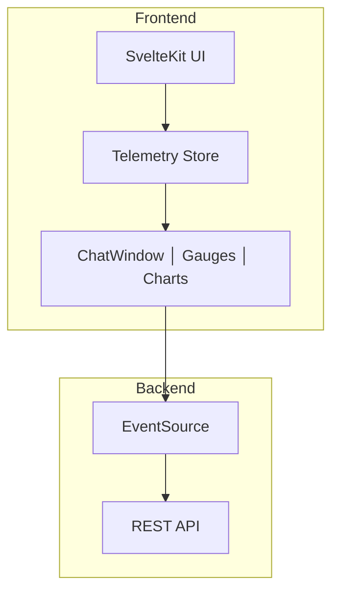

# Hardware Telemetry UI

Real-time hardware telemetry dashboard for ML workloads. Built with SvelteKit 5 and Tailwind CSS v4.

## Overview

Hardware Telemetry UI provides a real-time dashboard for monitoring:
- GPU utilization and memory
- CPU usage and temperature
- Token generation speed
- Latency metrics

## Features

| Feature | Description |
|---------|-------------|
| **Svelte 5** | Runes-based reactivity |
| **Tailwind CSS v4** | Utility-first styling |
| **Real-time Updates** | Server-Sent Events (SSE) |
| **Responsive** | Mobile-friendly layout |
| **TypeScript** | Full type safety |

## Quick Start

```bash
# Install dependencies
npm install

# Development
npm run dev

# Build
npm run build

# Preview
npm run preview
```

## Architecture



## Project Structure

```
hardware-telemetry-ui/
├── src/
│   ├── app.css              # Tailwind imports
│   ├── app.html             # HTML template
│   ├── app.d.ts             # Type declarations
│   ├── lib/
│   │   ├── components/
│   │   │   ├── ChatWindow.svelte
│   │   │   ├── Gauge.svelte
│   │   │   ├── MetricsChart.svelte
│   │   │   └── ConnectionStatus.svelte
│   │   └── stores/
│   │       └── telemetry.ts  # Telemetry store
│   └── routes/
│       ├── +layout.svelte    # Root layout
│       └── +page.svelte     # Main dashboard
├── static/
├── package.json
├── svelte.config.js
├── vite.config.ts
└── README.md
```

## Components

### ChatWindow

Chat interface for LLM interaction:

```svelte
<script lang="ts">
    interface Props {
        messages: Array<{ role: string; content: string }>;
        onSend?: (msg: string) => void;
    }
    
    let { messages, onSend }: Props = $props();
</script>
```

### Gauge

Circular gauge for metrics:

```svelte
<Gauge value={75} max={100} label="GPU Usage" />
```

### MetricsChart

Line chart for time-series data:

```svelte
<MetricsChart 
    data={[{timestamp: 1, value: 50}, {timestamp: 2, value: 60}]}
    label="GPU Utilization"
    color="#3b82f6"
/>
```

### ConnectionStatus

WebSocket connection indicator:

```svelte
<ConnectionStatus connected={true} latency={42} />
```

## Stores

### TelemetryStore

Svelte 5 runes-based state management:

```typescript
class TelemetryStore {
    messages = $state<Array<{ role: string; content: string }>>([]);
    telemetry = $state<TelemetryData[]>([]);
    connected = $state(false);
    latency = $state(0);
    
    connect() { /* ... */ }
    disconnect() { /* ... */ }
    sendMessage(content: string) { /* ... */ }
    
    get latest(): TelemetryData | null { /* ... */ }
}

export const telemetry = new TelemetryStore();
```

## API Integration

### SSE Connection

```typescript
this.eventSource = new EventSource('http://localhost:8080/api/v1/telemetry');

this.eventSource.onmessage = (e) => {
    const data = JSON.parse(e.data) as TelemetryData;
    this.telemetry = [...this.telemetry.slice(-60), data];
};
```

### REST API

```typescript
const resp = await fetch('http://localhost:8080/api/v1/chat', {
    method: 'POST',
    headers: { 'Content-Type': 'application/json' },
    body: JSON.stringify({ messages: this.messages, stream: true })
});
```

## Running

### Development

```bash
npm run dev
```

### Production Build

```bash
npm run build
npm run preview
```

## Requirements

- Node.js 20+
- npm 10+
- Go LLM Gateway running on port 8080

## Dependencies

- `@sveltejs/kit` - Framework
- `svelte` - UI library
- `tailwindcss` - Styling
- `@tailwindcss/vite` - Tailwind plugin
- `typescript` - Type safety

## License

MIT
