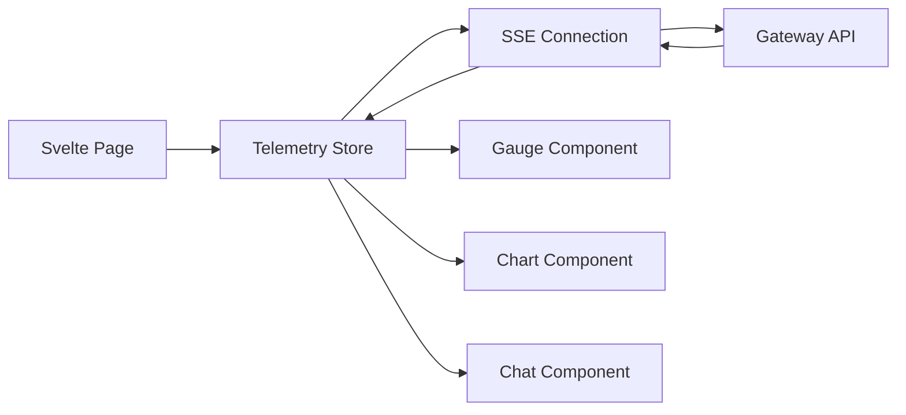
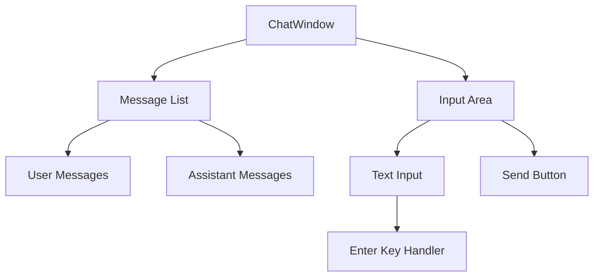
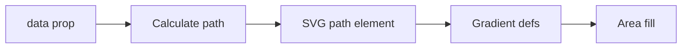

# Hardware Telemetry UI - Architecture

## System Overview

```
┌─────────────────────────────────────────────────────────────┐
│                    SvelteKit App                            │
│  ┌─────────────┐ ┌─────────────┐ ┌─────────────┐          │
│  │   Routes    │ │ Components  │ │   Stores    │          │
│  │ (+page)     │ │ (Gauge, etc)│ │ (telemetry) │          │
│  └─────────────┘ └─────────────┘ └─────────────┘          │
└─────────────────────────────────────────────────────────────┘
                              │
                              ▼
┌─────────────────────────────────────────────────────────────┐
│                   HTTP / SSE                                │
│        (Go LLM Gateway on localhost:8080)                   │
└─────────────────────────────────────────────────────────────┘
```

## Component Architecture

### Store Pattern (Svelte 5 Runes)

```typescript
class TelemetryStore {
    // Reactive state with $state
    messages = $state<Array<{ role: string; content: string }>>([]);
    telemetry = $state<TelemetryData[]>([]);
    connected = $state(false);
    
    // Derived values with $derived
    get latest(): TelemetryData | null {
        return this.telemetry.length > 0 
            ? this.telemetry[this.telemetry.length - 1] 
            : null;
    }
    
    // Methods
    connect() { /* ... */ }
}
```

### Component Data Flow



## Components

### ChatWindow



### Gauge

Uses derived signals for color:

```typescript
const percentage = $derived(Math.min((value / max) * 100, 100));
const color = $derived(
    percentage > 80 ? 'text-red-500' : 
    percentage > 60 ? 'text-yellow-500' : 
    'text-green-500'
);
```

### MetricsChart

SVG-based chart with gradient fill:



## State Management

### Telemetry Store

```typescript
interface TelemetryData {
    timestamp: number;
    gpuUtilization: number;
    gpuMemory: number;
    cpuUtilization: number;
    memoryUsed: number;
    memoryTotal: number;
    temperature: number;
    fanSpeed: number;
    powerDraw: number;
    tokensPerSecond: number;
    latency: number;
}

class TelemetryStore {
    messages = $state([]);
    telemetry = $state([]);
    connected = $state(false);
    latency = $state(0);
    
    private eventSource: EventSource | null = null;
    private maxHistory = 60;
    
    connect() { /* ... */ }
    disconnect() { /* ... */ }
    sendMessage(content: string) { /* ... */ }
}
```

## SOLID Principles

### Single Responsibility

| Component | Responsibility |
|-----------|---------------|
| `telemetry.ts` | State management |
| `ChatWindow.svelte` | Chat UI |
| `Gauge.svelte` | Metric display |
| `MetricsChart.svelte` | Chart rendering |
| `ConnectionStatus.svelte` | Connection indicator |

### Interface Segregation

```typescript
// Props interfaces for each component
interface GaugeProps {
    value: number;
    max: number;
    label: string;
    unit?: string;
}

interface ChatWindowProps {
    messages: Array<{ role: string; content: string }>;
    onSend?: (msg: string) => void;
}
```

### Dependency Inversion

```typescript
// Store depends on abstraction (EventSource)
class TelemetryStore {
    private eventSource: EventSource | null = null;
    
    connect() {
        this.eventSource = new EventSource(url);
    }
}
```

## Performance

### History Truncation

```typescript
private maxHistory = 60;

addData(data: TelemetryData) {
    this.telemetry = [
        ...this.telemetry.slice(-this.maxHistory), 
        data
    ];
}
```

### Derived Computations

```typescript
// Memoized derived value
const memPercent = $derived(
    data ? (data.memoryUsed / data.memoryTotal) * 100 : 0
);
```
