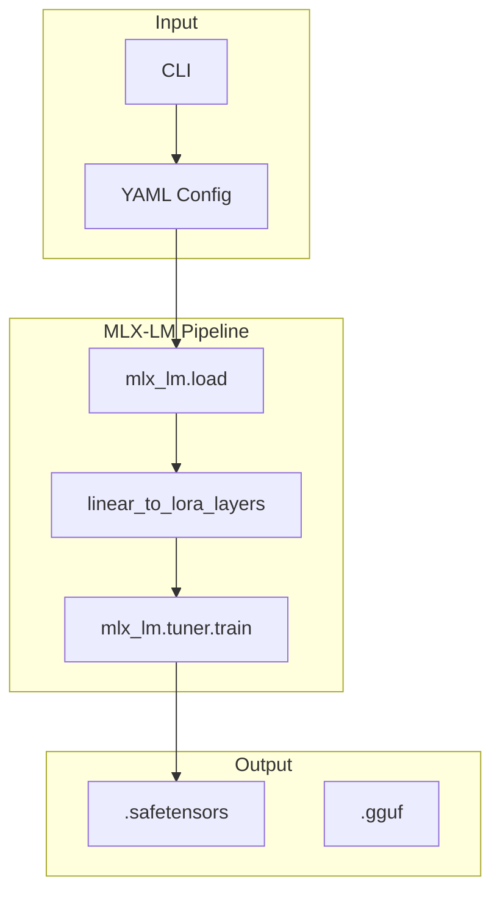

# MLX Tuner

Production-grade fine-tuning repository for Apple Silicon using Apple's MLX framework. Implements LoRA/QLoRA fine-tuning with GGUF export.

## Real Results

```
Trainable parameters: 0.021% (0.786M/3821.080M)
Starting training..., iters: 10

Iter 1: Val loss 2.484
Iter 10: Val loss 2.436
Train loss 2.586, Learning Rate 1.000e-05, It/sec 3.879, Tokens/sec 164.096, Peak mem 7.886 GB

Saved final weights to adapters/adapters.safetensors.
```

Trained Phi-3-mini-4k-instruct (3.8B params) on M4 Pro with 7.9GB peak memory!

## Features & Concepts (GenAI Developer's Glossary)

If you're coming from high-level APIs (OpenAI, HuggingFace `pipeline()`), here's the plain English translation:

| Feature/Concept | Simple Explanation |
|---------------|------------------|
| **LoRA** | "Sticky notes on a textbook." Instead of rewriting 3B+ weights, we freeze the model and add small trainable matrices. 99%+ memory reduction. |
| **LoRA Rank ($r$)** | Size of the sticky note. Rank 8 = small note (fast). Rank 64 = bigger note (more expressiveness). |
| **LoRA Alpha ($\alpha$)** | Volume knob for the sticky note. Controls how much it influences the base model. |
| **Quantization** | Converting .wav to .mp3. 32-bit → 4-bit. Massive memory savings with minimal quality loss. |
| **QLoRA** | Zip the textbook first (quantize), then train sticky notes on top. Fits 70B model in 24GB! |
| **GGUF** | .zip file for LLMs. Packs weights + tokenizer for fast C++ loading. |
| **Unified Memory** | CPU + GPU share same RAM. No slow PCIe transfers—just pass pointers. |
| **Protocol DI** | "I don't care what object you pass, as long as it has `.load()`" - easy testing. |

## Quick Start

```bash
# Install (creates .venv automatically)
make install

# Run training via config file
mlx_lm.lora -c train_config.yaml
```

### Training Config (train_config.yaml):

```yaml
model: microsoft/Phi-3-mini-4k-instruct
train: true
fine_tune_type: lora
data: ./data
num_layers: 4
batch_size: 1
iters: 10
lora_parameters:
  rank: 4
  scale: 8
  dropout: 0.05
adapter_path: ./adapters
optimizer: adamw
```

### Or use the CLI wrapper:

```bash
.venv/bin/python -m mlx_tuner.cli train \
    --modelmicrosoft/Phi-3-mini-4k-instruct \
    --data ./data \
    --steps 100 \
    --rank 8 \
    --layers 16
```

## Supported Models

Works with any HuggingFace model with chat template:

- `microsoft/Phi-3-mini-4k-instruct` ✅ (tested)
- `meta-llama/Llama-3.2-1B-Instruct`
- `HuggingFaceTB/SmolLM-135M` (needs text format, not messages)

## Architecture



## Project Structure

```
mlx-tuner/
├── src/mlx_tuner/
│   ├── __init__.py
│   ├── config.py              # Pydantic configs
│   ├── logging.py            # structlog
│   ├── protocols.py        # Protocol DI
│   ├── cli/                # CLI commands
│   │   ├── train.py
│   │   ├── fuse.py
│   │   └── convert.py
│   ├── data/               # Dataset loaders
│   ├── models/             # mlx_lm.load
│   ├── training/           # LoRA implementation
│   │   ├── lora.py
│   │   └── trainer.py
│   └── convert/           # GGUF export
├── data/                   # Training data (train.jsonl)
├── adapters/              # Saved LoRA adapters
├── train_config.yaml       # Training config
├── Makefile
└── README.md
```

## Data Format

Each line in `train.jsonl` (text format):

```json
{"text": "Instruction: Explain ML.\n\nResponse: Machine learning is..."}
```

Or messages format (for models with chat template):

```json
{"messages": [{"role": "user", "content": "Hello"}, {"role": "assistant", "content": "Hi!"}]}
```

## Memory Requirements

| Model | Size | LoRA Rank | Batch | Peak Memory |
|-------|------|-----------|-------|------------|
| Phi-3-mini | 3.8B | 4 | 1 | 7.9 GB |
| Llama-3.2-1B | 1B | 8 | 1 | ~3 GB |
| SmolLM-135M | 135M | 8 | 2 | ~1 GB |

## Requirements

- Python 3.11+
- Apple Silicon (M1/M2/M3/M4)
- 24GB+ unified memory recommended
- macOS 15+

## Dependencies

- `mlx` - Apple's ML framework
- `mlx-lm` - Language model utilities (includes LoRA tuner)
- `transformers` - HuggingFace transformers
- `peft` - Parameter-efficient fine-tuning (reference)
- `pydantic-settings` - Configuration
- `structlog` - Structured logging
- `pytest` - Testing

## License

MIT